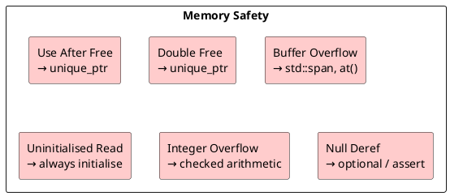

# Chapter 10: Security in Code and Deployment

**Book Pages**: 296–318 | *Software Architecture with C++* by Ostrowski & Gaczkowski

---

## Why This Chapter Matters

C++ gives developers direct control over memory — a double-edged sword. This chapter covers
the full spectrum of C++ security: secure design principles, memory safety, dependency
security, compiler hardening, and the OWASP Top 10 in C++ context.

---

## 10.1 Security-Conscious Design

### Making Interfaces Hard to Misuse

The best security comes from making unsafe usage impossible or at least obvious:

```cpp
// BAD: raw buffer — size mismatch is a buffer overflow
void process(const char* data, int size);

// BETTER: span provides bounds-checking
void process(std::span<const char> data);

// BEST: named type + constructor validation
class validated_payload {
    std::vector<std::byte> data_;
    static constexpr size_t max_size = 65536;
public:
    explicit validated_payload(std::span<const std::byte> input) {
        if (input.size() > max_size)
            throw std::invalid_argument("payload exceeds max size");
        data_.assign(input.begin(), input.end());
    }
    std::span<const std::byte> data() const { return data_; }
};
```

### OWASP Top 10 in C++ Context

| OWASP Category | C++ Manifestation | Mitigation |
|---|---|---|
| **Injection** | SQL injection via string concat, command injection | Prepared statements, parameterised APIs |
| **Broken Authentication** | Hardcoded credentials, weak session tokens | Secrets in env vars; use strong random tokens |
| **Sensitive Data Exposure** | PII in logs, unencrypted storage | Mask logs; encrypt at rest (AES-256) |
| **XML/XXE** | Unsafe XML parser | Disable external entity processing |
| **Broken Access Control** | Missing authorisation checks | Deny by default; check at every layer |
| **Security Misconfiguration** | Debug builds in production, verbose errors | Separate configs; minimal permissions |
| **XSS** | N/A (mostly web) | If embedding HTML: proper escaping |
| **Insecure Deserialization** | Deserialising untrusted data to objects | Validate schema before deserialising |
| **Known Vulnerable Components** | Using libssl 1.0, ancient Boost | Automated CVE scanning; dependency updates |
| **Insufficient Logging** | No audit trail | Log all security events with trace IDs |

---

## 10.2 Drawbacks of Concurrency and Memory Safety

### Data Races

```cpp
// UNSAFE: data race — undefined behaviour
int shared_counter = 0;
std::thread t1([] { ++shared_counter; });
std::thread t2([] { ++shared_counter; });
// Result: 1, 2, or UB

// SAFE: atomic operation
std::atomic<int> safe_counter = 0;
std::thread t1([] { ++safe_counter; });
std::thread t2([] { ++safe_counter; });
// Result: always 2
```

### Memory Safety Checklist



---

## 10.3 Secure Coding Guidelines (C++ Core Guidelines)

Key rules with security implications:

| Rule | Description |
|------|-------------|
| **I.22** | Don't perform complex initialisation of global objects |
| **C.80** | Use `= default` if you want copy/move semantics |
| **ES.34** | Don't define a variadic function |
| **ES.65** | Don't dereference an invalid pointer |
| **CP.2** | Avoid data races |
| **SL.con.1** | Prefer using STL `array` or `vector` instead of raw arrays |
| **Pro.bounds** | Use bounds-safe profiles to eliminate buffer overflows |

C++ Core Guidelines Safety Profile (`[[gsl::suppress]]`) and GSL tools enforce these rules
at compile time.

---

## 10.4 Automated Security Checks

### Compiler Warnings for Security

```bash
# GCC/Clang security flags
-D_FORTIFY_SOURCE=2    # Detects buffer overflows in standard functions
-fstack-protector-strong  # Stack canaries
-fPIE -pie             # Position-independent executable (for ASLR)
-Wformat-security      # Format string vulnerabilities
-Werror=format-security
```

### Static Analysis

```bash
# clang-tidy security checks
clang-tidy --checks='cert-*,cppcoreguidelines-*,security-*' myfile.cpp

# cppcheck
cppcheck --enable=all --error-exitcode=1 src/

# Address Sanitizer (dynamic — catches runtime memory errors)
cmake -DCMAKE_CXX_FLAGS="-fsanitize=address,undefined" ..
```

### Dependency Security

```bash
# Check for known CVEs in dependencies
# With Conan: check OSS Index
conan graph info . | grep CVE

# With vcpkg: automated vulnerability scanning
# With OWASP Dependency Check:
dependency-check --project "MyApp" --scan ./lib/
```

---

## 10.5 Hardening the Environment

### Static vs Dynamic Linking for Security

| Aspect | Static | Dynamic |
|--------|--------|---------|
| Vulnerability patching | Requires full rebuild + redeploy | Update shared lib without rebuild |
| Binary hardening | Easier — single artifact | More complex — all libs must be hardened |
| Supply chain | Includes dependency at build time | Runtime dependency — can be swapped |

### Address Space Layout Randomisation (ASLR)

ASLR randomises the memory addresses where code and data are loaded, making it harder
for attackers to predict exploit targets.

Enable in CMake:
```cmake
target_compile_options(myapp PRIVATE -fPIE)
target_link_options(myapp PRIVATE -pie)
```

### Process Isolation

Run services with minimal privileges:
```dockerfile
# Run as non-root in Docker
RUN addgroup --system appgroup && adduser --system appuser --ingroup appgroup
USER appuser
```

---

## Common Mistakes / Anti-Patterns

| Anti-Pattern | Description | Fix |
|---|---|---|
| **Trust user input** | Process raw input without validation | Validate all external data at boundaries |
| **Secrets in code** | API keys, DB passwords in source | Use environment variables or secrets manager |
| **No CVE scanning** | Using outdated libraries with known vulnerabilities | Integrate dependency scanning in CI |
| **Verbose error messages to clients** | Stack traces / DB error in API response | Log details internally; return generic error to client |
| **No audit logging** | Security events not recorded | Log authentication, authorisation, and data access |
| **Disabled sanitizers** | "They slow down the build" | Run sanitizers in CI Debug builds |

---

## Key Takeaways

1. **Secure by design** — make insecure usage a compile error, not a runtime surprise
2. **Use RAII and smart pointers** — eliminates entire classes of memory vulnerabilities
3. **Validate at system boundaries** — untrusted input comes from: network, files, env, users
4. **Automate security scanning** — compiler warnings + static analysis + CVE scanning in CI
5. **ASLR + stack protectors** — enable at build time; free security hardening
6. **Principle of least privilege** — run services as non-root with minimal capability grants
