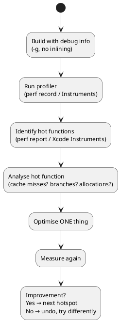
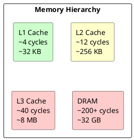

# Chapter 11: Performance

**Book Pages**: 319–348 | *Software Architecture with C++* by Ostrowski & Gaczkowski

---

## Why This Chapter Matters

C++ is chosen for performance-critical applications. This chapter covers how to measure
performance correctly, profile to find real bottlenecks, optimise based on hardware realities,
and parallelise computation — all without premature optimisation.

> *"Premature optimisation is the root of all evil."* — Knuth
> *"But profile first, then optimise the actual bottleneck."* — everyone who has been burned

---

## 11.1 Measuring Performance Correctly

### The Golden Rule

**Never optimise without measurement.** Intuition about bottlenecks is wrong more often than right.
Measurement reveals:
- Where the actual time is spent
- Whether a proposed change actually improves things
- Whether the improvement matters at the system level

### Using Microbenchmarks (Google Benchmark)

```cpp
#include <benchmark/benchmark.h>

static void BM_string_concatenation_plus(benchmark::State& state) {
    for (auto _ : state) {
        std::string result;
        for (int i = 0; i < state.range(0); ++i)
            result += "x";
        benchmark::DoNotOptimize(result);
    }
}
BENCHMARK(BM_string_concatenation_plus)->Range(8, 8 << 10);

static void BM_string_concatenation_reserve(benchmark::State& state) {
    for (auto _ : state) {
        std::string result;
        result.reserve(state.range(0));
        for (int i = 0; i < state.range(0); ++i)
            result += "x";
        benchmark::DoNotOptimize(result);
    }
}
BENCHMARK(BM_string_concatenation_reserve)->Range(8, 8 << 10);
```

**Pitfalls**:
- Dead code elimination: use `benchmark::DoNotOptimize`
- Frequency scaling: pin CPU or use `--benchmark_cpu_frequency`
- Warmup: Google Benchmark handles this automatically

---

## 11.2 Profiling

### Types of Profilers

| Type | Overhead | What It Measures |
|------|----------|-----------------|
| **Sampling** (perf, Instruments) | Low (1-5%) | Where time is spent, statistical |
| **Instrumentation** (gprof) | High (2-10×) | Exact call counts and times |
| **Hardware counters** (perf stat) | Negligible | Cache misses, branch mispredictions |
| **Tracing** (Tracy, LTTng) | Low-medium | Timeline of events with context |

### Profiling Workflow



---

## 11.3 Helping the Compiler Generate Performant Code

### `const` and `constexpr`

```cpp
// Without const: compiler uncertain whether value changes
// Must reload from memory on every access
double compute(double* values, int n) { ... }

// With const: compiler can cache in register
double compute(const double* values, int n) { ... }

// constexpr: value known at compile time — no memory access at all
constexpr double pi = 3.14159265358979;
```

### Profile-Guided Optimisation (PGO)

```bash
# Step 1: Instrument build
g++ -fprofile-generate -O2 -o myapp myapp.cpp

# Step 2: Run with representative input
./myapp realistic_input.dat

# Step 3: Rebuild with profile data
g++ -fprofile-use -O2 -o myapp_pgo myapp.cpp
# Compiler now knows which branches are taken, which functions are hot
```

---

## 11.4 Cache-Friendly Data Design

Modern CPUs are 100–1000× faster than memory. Cache misses are the dominant performance killer.



### Array of Structs vs Struct of Arrays

```cpp
// AoS — poor cache utilisation for position-only algorithms
struct entity { float x, y, z, mass, health; };
std::vector<entity> entities;
// Processing positions: loads mass and health too (cold data)

// SoA — excellent cache utilisation for SIMD/vectorisation
struct entity_pool {
    std::vector<float> x, y, z;     // hot for physics
    std::vector<float> mass;
    std::vector<float> health;      // hot for combat
};
// Processing positions: only x, y, z in cache
```

**Rule**: Use SoA when algorithms process subsets of fields over many elements.

### Avoiding False Sharing

```cpp
// BAD: counter1 and counter2 in the same cache line
struct counters { int counter1; int counter2; };

// GOOD: pad to different cache lines (64 bytes on x86-64)
struct padded_counter {
    int value;
    char padding[60]; // total = 64 bytes = one cache line
};
```

---

## 11.5 Parallelising Computations

### C++17 Parallel Algorithms

```cpp
#include <execution>
#include <algorithm>
#include <vector>
#include <numeric>

std::vector<double> data = /* ... */;

// Parallel sort — uses thread pool internally
std::sort(std::execution::par_unseq, data.begin(), data.end());

// Parallel reduce
double total = std::reduce(std::execution::par_unseq,
                           data.begin(), data.end(), 0.0);
```

### OpenMP

```cpp
#pragma omp parallel for schedule(dynamic, 64)
for (int i = 0; i < n; ++i) {
    results[i] = expensive_computation(inputs[i]);
}
```

---

## 11.6 Coroutines (C++20) for Concurrency

```cpp
#include <coroutine>

// Generator coroutine — yields values lazily
template<typename T>
struct generator {
    struct promise_type {
        T current_value;
        auto yield_value(T val) {
            current_value = val;
            return std::suspend_always{};
        }
        auto get_return_object() { return generator{handle::from_promise(*this)}; }
        auto initial_suspend() { return std::suspend_always{}; }
        auto final_suspend() noexcept { return std::suspend_always{}; }
        void return_void() {}
        void unhandled_exception() { std::terminate(); }
    };
    using handle = std::coroutine_handle<promise_type>;
    handle coro;
    bool next() { coro.resume(); return !coro.done(); }
    T value() const { return coro.promise().current_value; }
    ~generator() { if (coro) coro.destroy(); }
};
```

---

## Common Mistakes / Anti-Patterns

| Anti-Pattern | Description | Fix |
|---|---|---|
| **Optimise first, measure never** | Making the code complex without proving improvement | Always benchmark before and after |
| **Micro-optimising cold code** | 20 hours saving 5ms in a function called once | Profile; only optimise the hot path |
| **AoS for hot loops** | Loading unnecessary fields into cache | Switch to SoA for hot data paths |
| **Heap allocations in loops** | `new` inside a tight loop | Pre-allocate, use object pools, or stack allocators |
| **False sharing** | Adjacent atomic/counter in same cache line | Pad to cache line size |
| **Over-parallelisation** | Threads for sub-microsecond tasks | Parallelism has overhead; only applies for ≥ 1ms tasks |

---

## Key Takeaways

1. **Measure first** — profiling tells you where to optimise; intuition is usually wrong
2. **Cache is king** — memory layout decisions have the highest performance impact
3. **SoA over AoS** for hot loops that process field subsets
4. **Parallel STL algorithms** — `std::execution::par_unseq` is often a one-line win
5. **`const` everywhere** — helps the compiler, documents intent, catches bugs
6. **PGO** — let real-world usage patterns guide compiler optimisation
