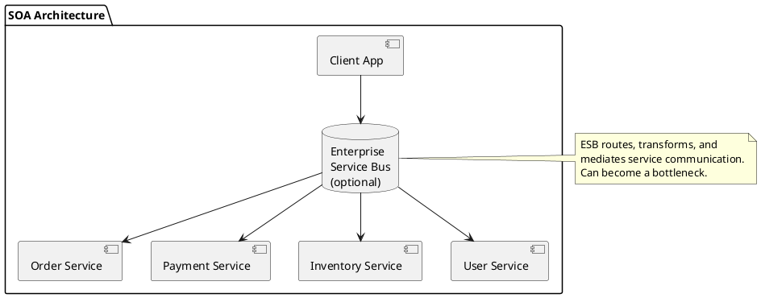
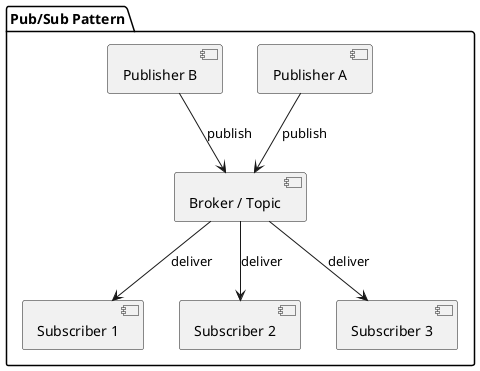
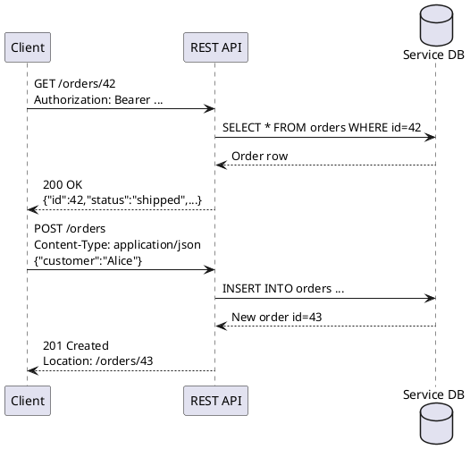
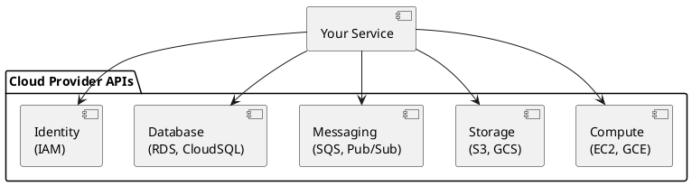

# Chapter 12: Service-Oriented Architecture

**Book Pages**: 350–383 | *Software Architecture with C++* by Ostrowski & Gaczkowski

---

## Why This Chapter Matters

SOA is the architectural foundation for any system built from independent, communicating
services. This chapter covers the spectrum of messaging and communication options — from
low-overhead MQTT to REST/HTTP to gRPC — and how to choose the right approach.

---

## 12.1 Understanding SOA

Service-Oriented Architecture organises a system as a collection of loosely coupled,
interoperable services. Each service:
- Has a well-defined interface (contract)
- Is independently deployable
- Communicates over a standard protocol
- Encapsulates its own data



---

## 12.2 Messaging Patterns

### Message Queues vs Message Brokers

| Pattern | Description | Examples |
|---------|-------------|---------|
| **Point-to-point queue** | Single producer, single consumer | RabbitMQ queues |
| **Publish-subscribe** | One producer, many consumers | Kafka topics, MQTT |
| **Request-reply** | Synchronous over async transport | RabbitMQ RPC pattern |



### MQTT (IoT and low-overhead messaging)

```cpp
// MQTT publish (using mosquitto C++ wrapper)
mosquitto_client client("client_id");
client.connect("broker.example.com", 1883);
client.publish("sensors/temperature", "23.5", 1 /* QoS */);
```

**MQTT QoS levels**:
- 0: At most once (fire and forget)
- 1: At least once (may duplicate)
- 2: Exactly once (highest overhead)

### ZeroMQ (low-latency, broker-free messaging)

```cpp
// ZeroMQ push-pull pipeline
zmq::context_t ctx;
zmq::socket_t push(ctx, zmq::socket_type::push);
push.bind("tcp://*:5555");
push.send(zmq::message_t{"hello"}, zmq::send_flags::none);
```

---

## 12.3 Web Services

### REST (REpresentational State Transfer)



**REST design principles**:
- Resources identified by URIs (`/orders`, `/orders/{id}`)
- HTTP verbs express intent: GET (read), POST (create), PUT (replace), PATCH (partial update), DELETE
- Stateless: each request carries all necessary context
- Hypermedia links guide discoverability (HATEOAS)

### gRPC (high-performance RPC)

```protobuf
// orders.proto
service OrderService {
  rpc GetOrder (GetOrderRequest) returns (Order);
  rpc PlaceOrder (PlaceOrderRequest) returns (Order);
  rpc ListOrders (ListOrdersRequest) returns (stream Order);
}
message Order {
  int32 id = 1;
  string customer = 2;
  double total = 3;
  string status = 4;
}
```

Benefits over REST:
- Binary serialisation (Protocol Buffers) — ~5× smaller, ~10× faster to serialise
- Streaming support (server-side, client-side, bidirectional)
- Strong typing — schema enforced at compile time
- HTTP/2 — multiplexed connections

---

## 12.4 Cloud Computing as an Extension of SOA

Cloud providers expose infrastructure as services via APIs:



**Managed services trade-off**:
- Faster to adopt, less operational burden
- Vendor lock-in: migrating away is expensive
- Abstract over implementation: use cloud-provider-agnostic interfaces in code

---

## Common Mistakes / Anti-Patterns

| Anti-Pattern | Description | Fix |
|---|---|---|
| **ESB as a single point of failure** | All traffic through one ESB | Add redundancy; consider broker-less messaging |
| **Chatty REST** | 10 round trips to render one page | Use GraphQL or composite APIs |
| **Synchronous coupling** | Service A blocks on service B | Use async messaging where latency allows |
| **No versioning** | API changes break all clients | Version APIs (URL or header); deprecate gracefully |
| **Ignoring backpressure** | Producer overwhelms consumer | Use bounded queues; implement backpressure signals |
| **No idempotency** | Retry sends double payment | All mutating operations must be idempotent |

---

## Key Takeaways

1. **SOA is about contracts and independence** — services communicate through well-defined APIs
2. **Choose messaging based on requirements** — MQTT for IoT, gRPC for internal services, REST for
   external APIs
3. **Async messaging decouples producers from consumers** — use it when immediate response isn't required
4. **API versioning is mandatory** — plan for it from day one
5. **Idempotency** — all state-changing operations must be safely retryable
6. **Managed cloud services** — accept the trade-off: convenience vs. lock-in
