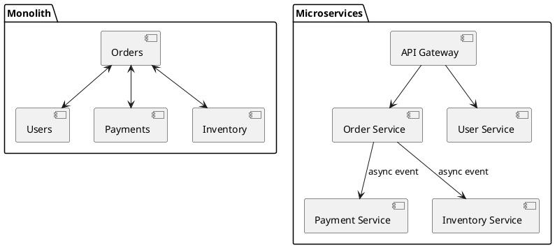
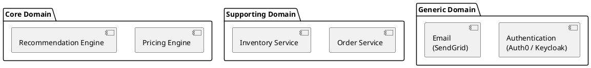
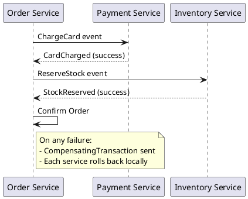
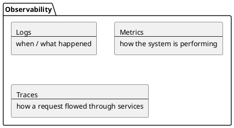
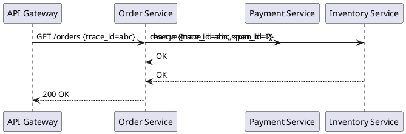
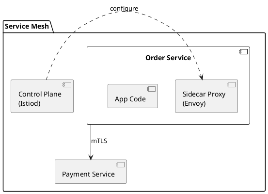

# Chapter 13: Designing Microservices

**Book Pages**: 384–421 | *Software Architecture with C++* by Ostrowski & Gaczkowski

---

## Why This Chapter Matters

Microservices decompose a system into independently deployable units that can scale, fail,
and evolve independently. This chapter covers the decomposition strategies, intra-service
communication, and the observability stack that makes microservices manageable in production.

---

## 13.1 What Are Microservices?

Microservices are an **architectural style** in which a system is structured as a collection
of small, independently deployable services, each:
- Modelling a bounded context from the domain
- Owning its own database
- Communicating via lightweight protocols
- Deployed independently and automatically



---

## 13.2 Decomposition Strategies

### Decompose by Business Capability

Identify the core business functions and create one service per capability:

| Capability | Service | Owns |
|---|---|---|
| Customer management | `user-service` | users DB, auth |
| Order management | `order-service` | orders DB |
| Payment processing | `payment-service` | payment DB, ledger |
| Inventory tracking | `inventory-service` | stock DB |
| Notifications | `notification-service` | templates, delivery |

### Decompose by Subdomain (DDD)

Use Domain-Driven Design bounded contexts:
- **Core domains** — competitive advantage, invest heavily
- **Supporting domains** — necessary but not differentiating
- **Generic domains** — commodity, use off-the-shelf solutions



---

## 13.3 Service Communication Patterns

### Synchronous (HTTP/gRPC)

- Simple to implement and debug
- Temporal coupling — client waits for response
- Risk: cascading failures if downstream is slow

### Asynchronous (Events / Queues)

- Temporal decoupling — producer continues immediately
- Better fault isolation (queue buffers demand)
- Complexity: ordering, deduplication, dead-letter queues

### The Saga Pattern for Distributed Transactions



Saga compensating transactions:
- `ChargeCard` ← compensated by `RefundCard`
- `ReserveStock` ← compensated by `ReleaseStock`

---

## 13.4 Observability

Microservices require observability to debug production failures across service boundaries.

### The Three Pillars



### Logging

Structured logs (JSON) are machine-parseable:
```json
{
  "level": "error",
  "service": "order-service",
  "trace_id": "abc123",
  "message": "Payment failed",
  "order_id": 42,
  "error_code": "INSUFFICIENT_FUNDS",
  "timestamp": "2024-06-01T12:00:00Z"
}
```

**Correlation IDs**: Every request generates a unique `trace_id` that is propagated through all
downstream calls, enabling end-to-end trace reconstruction.

### Metrics

Key metrics per service (RED method):
- **Rate** — requests per second
- **Errors** — error rate (%)
- **Duration** — P50, P95, P99 latency

Infra metrics (USE method):
- **Utilisation** — CPU, memory, disk %
- **Saturation** — queue depth, run queue
- **Errors** — hardware / OS errors

### Distributed Tracing



Tools: OpenTelemetry (standard), Jaeger, Zipkin, Tempo.

---

## 13.5 Service Mesh

A service mesh (e.g., Istio, Linkerd) moves cross-cutting concerns out of the application:
- **mTLS** — mutual TLS between all services
- **Retries and circuit breaking** — at the network layer
- **Telemetry** — auto-injected metrics and traces
- **Traffic management** — canary, A/B, blue-green



---

## Common Mistakes / Anti-Patterns

| Anti-Pattern | Description | Fix |
|---|---|---|
| **Nanoservices** | Services too fine-grained; high inter-service communication | Use domain-driven decomposition; merge chatty services |
| **Shared database** | Multiple services write to the same table | Each service owns its schema; use events to sync |
| **Distributed monolith** | Micro deployments but tightly coupled code | Fix coupling first; deploy independently second |
| **No observability** | Can't debug production failures | Implement tracing + structured logging before going live |
| **Synchronous everything** | Deep call chains cause cascading failures | Use async events for non-critical flows |
| **No API versioning** | Changes break downstream consumers | Version all service APIs from day one |

---

## Key Takeaways

1. **Decompose by domain, not by layer** — bounded contexts define service boundaries
2. **Each service owns its data** — never share a database schema between services
3. **Asynchronous communication** reduces coupling and improves resilience
4. **Sagas handle distributed transactions** — design compensating transactions upfront
5. **Observability is not optional** — structured logs, metrics, and traces are production
   requirements
6. **Service meshes move cross-cutting concerns to the infrastructure** — keep application
   code focused on business logic
