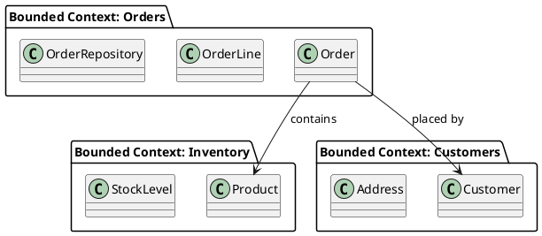
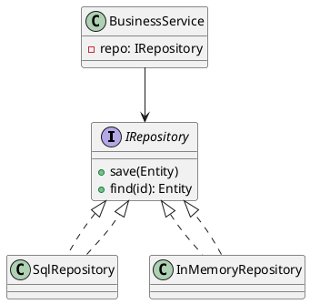
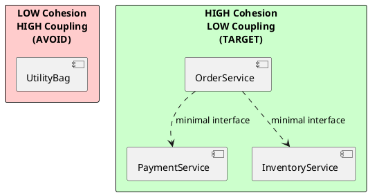

# Chapter 1: Importance of Software Architecture and Principles of Great Design

**Book Pages**: 7–30 | *Software Architecture with C++* by Ostrowski & Gaczkowski

---

## Why This Chapter Matters

Before writing a single line of code, an architect must answer: *What structure will let this
system evolve, scale, and be maintained for years?* Chapter 1 provides the conceptual vocabulary
every subsequent chapter builds upon. It answers:

- What is software architecture and why does it matter more than any single design pattern?
- How do SOLID and DRY principles translate into concrete C++ architecture decisions?
- How does coupling and cohesion shape the physical structure of a system?

---

## 1.1 Understanding Software Architecture

Software architecture is **the set of fundamental structural decisions about a system** that are
costly to change once made. These include:

- How the system is divided into components
- How those components communicate
- What quality attributes (performance, security, testability) the design optimises for
- What constraints the system must satisfy

### Different Ways to Look at Architecture

Architecture can be viewed from multiple perspectives simultaneously (see §1.3 for the 4+1 model):

| View | Question answered |
|------|------------------|
| **Logical** | What are the major functional elements? |
| **Process** | How do processes communicate and synchronise? |
| **Development** | How is the code organised for the team? |
| **Physical** | How does it deploy to hardware? |
| **Use-case (+1)** | What scenarios does it enable? |

---

## 1.2 The Importance of Proper Architecture

### Software Decay

A system undergoes **software decay** (also called *software rot* or *bit rot*) when:

- Shortcuts are taken repeatedly under schedule pressure
- Technical debt accumulates without being repaid
- Dependencies become tangled, making changes increasingly risky
- Tests become hard to write, so fewer are written, so quality degrades further

> **Key insight**: Decay is not inevitable. It is the predictable outcome of making short-term
> decisions without a long-term architecture. Good architecture slows decay to near zero.

### Accidental Architecture

When no deliberate architecture exists, one still emerges — this is *accidental architecture*.
It reflects the path of least resistance: whoever modified the code most recently, whatever
framework was easiest to use, whatever was working in the prototype.

Accidental architectures are characterized by:
- Modules that "just evolved" without clear responsibilities
- No clear separation between domain logic and infrastructure
- Coupling everywhere — "everything knows everything"
- Impossible to test in isolation

---

## 1.3 Exploring the Fundamentals of Good Architecture

### Architecture Context

Every system exists in a context:

```plantuml
@startuml
!include https://raw.githubusercontent.com/plantuml-stdlib/C4-PlantUML/master/C4_Context.puml
Person(user, "End User")
System(system, "Target System", "The software we are designing")
System_Ext(extA, "External Service A")
System_Ext(extB, "External Service B")
Rel(user, system, "Uses")
Rel(system, extA, "Calls")
Rel(system, extB, "Reads from")
@enduml
```

The architecture must account for:
- **Stakeholders**: Users, developers, ops teams, business owners — each with different quality
  priorities
- **Business environment**: Regulatory requirements, market speed, team size
- **Technical environment**: Available infrastructure, existing systems, tooling

### Agile Architecture and DDD

**Domain-Driven Design (DDD)** aligns software structure with business reality:



DDD key concepts:
- **Bounded context**: A cohesive sub-domain with its own model and language
- **Ubiquitous language**: Domain terms used identically in code and conversations
- **Aggregate**: A cluster of domain objects treated as a single unit for consistency
- **Domain service**: Stateless operations that don't belong on a single entity

---

## 1.4 SOLID Principles in C++

### Single Responsibility Principle (SRP)

> *A class should have only one reason to change.*

**Anti-pattern (violates SRP)**:
```cpp
class UserManager {
    void create_user(const std::string& name);
    void send_welcome_email(const User& user);   // email concern
    void log_activity(const std::string& event); // logging concern
    void save_to_database(const User& user);      // persistence concern
};
```

**Correct (SRP applied)**:
```cpp
class UserRepository { void save(const User& user); };
class EmailService    { void send_welcome(const User& user); };
class ActivityLogger  { void log(const std::string& event); };
class UserService {
    UserRepository& repo_;
    EmailService&   email_;
    ActivityLogger& logger_;
    void create_user(const std::string& name);
};
```

### Open-Closed Principle (OCP)

> *Software entities should be open for extension, closed for modification.*

Achieved in C++ via:
- Abstract base classes + virtual dispatch
- Policy-based design (templates)
- `std::function` / callbacks for customisation points

```cpp
// Closed for modification — open for extension via new subclasses
class shape {
public:
    virtual double area() const = 0;
    virtual ~shape() = default;
};
class circle : public shape { double area() const override; };
class rectangle : public shape { double area() const override; };
// Add triangle: NO modification to shape or existing classes needed
```

### Liskov Substitution Principle (LSP)

> *Derived types must be substitutable for their base types without altering program correctness.*

The classic **rectangle/square anti-pattern** in C++:
```cpp
// VIOLATION: Square is NOT substitutable for Rectangle
class Rectangle {
    virtual void set_width(int w);
    virtual void set_height(int h);
};
class Square : public Rectangle {
    void set_width(int w) override { width_ = height_ = w; }  // breaks caller assumption
};
```

LSP-safe design: use composition or model square separately when the invariants differ.

### Interface Segregation Principle (ISP)

> *No client should be forced to depend on interfaces it does not use.*

```cpp
// VIOLATION: fat interface
class IDevice {
    virtual void print(Document&) = 0;
    virtual void scan(Document&) = 0;
    virtual void fax(Document&) = 0;
};

// CORRECT: segregated interfaces
class IPrinter { virtual void print(Document&) = 0; };
class IScanner  { virtual void scan(Document&) = 0; };
class IFax      { virtual void fax(Document&) = 0; };
class AllInOnePrinter : public IPrinter, public IScanner, public IFax { ... };
```

### Dependency Inversion Principle (DIP)

> *High-level modules must not depend on low-level modules. Both should depend on abstractions.*



In C++, DIP is achieved via:
- Pure abstract classes as interfaces
- Dependency injection (constructor injection preferred)
- No `new` inside business logic — wiring happens at the composition root

---

## 1.5 The DRY Rule

> *Don't Repeat Yourself* — every piece of knowledge should have a single, unambiguous
> representation in the system.

DRY violations to avoid:
- Duplicated business logic in multiple services/classes
- Copy-pasted validation logic across endpoints
- Magic constants repeated throughout the codebase
- Same SQL query written in three places with slight differences

DRY in C++ is achieved via:
- `constexpr` / `inline constexpr` for constants
- Template utility functions for repeated algorithms
- Policy classes / type traits for shared behaviour
- Clear ownership of business rules in domain services

---

## 1.6 Coupling and Cohesion

### Coupling

**Coupling** measures how much one module depends on the internals of another.

| Type | Description | C++ Example |
|------|-------------|-------------|
| **Content** (worst) | A directly modifies B's data | Accessing private members via `friend` |
| **Common** | A and B share global state | `extern int g_counter` |
| **Control** | A passes a flag that controls B's logic | `process(true, false, 3)` |
| **Stamp** | A passes more data than B needs | Passing whole `User` when only `id` needed |
| **Data** (best) | A passes only what B needs | `process(int id)` |

**Goal**: minimise coupling. Prefer data coupling; eliminate content coupling entirely.

### Cohesion

**Cohesion** measures how strongly related the responsibilities within a module are.

| Type | Description |
|------|-------------|
| **Functional** (best) | Module does exactly one well-defined thing |
| **Sequential** | Output of one function is input to next |
| **Communicational** | Functions work on the same data |
| **Procedural** | Functions run in a specific order but are otherwise unrelated |
| **Coincidental** (worst) | Functions grouped arbitrarily |

**Goal**: maximise cohesion. A class or module should have a clear, focused purpose.



---

## Common Mistakes / Anti-Patterns

| Anti-Pattern | Description | Fix |
|---|---|---|
| **God class** | One class does everything | Split by SRP |
| **Tight coupling** | Components directly reference each other's internals | Depend on abstractions |
| **LSP violation** | Subclass breaks parent's behaviour contract | Redesign hierarchy or use composition |
| **Feature envy** | Method constantly accesses data from another class | Move method to the class it depends on |
| **Shotgun surgery** | One change requires edits in many places | Consolidate responsibility (DRY) |
| **Primitive obsession** | Using primitives instead of domain types | Use strong types |

---

## Trade-offs and Decision Guidelines

| When you need... | Consider... |
|---|---|
| Extension without modification | OCP via abstract classes or policy templates |
| Testability of a module | DIP via constructor-injected interfaces |
| Reducing rebuild cascades | Low coupling; depend on abstractions not concretions |
| Clear domain model | DDD bounded contexts and ubiquitous language |
| Type-safe APIs | Strong typedefs / `enum class` / wrapper types |

---

## Key Takeaways

1. Architecture is the set of *hard-to-change* structural decisions — get them right early
2. SOLID and DRY are not rules of style — they are tools for managing change and complexity
3. High cohesion + low coupling is the universal goal at every granularity level
4. DDD aligns your architecture with the business domain, making it resilient to business change
5. Good architecture makes testing easy — if something is hard to test, the architecture has a flaw
