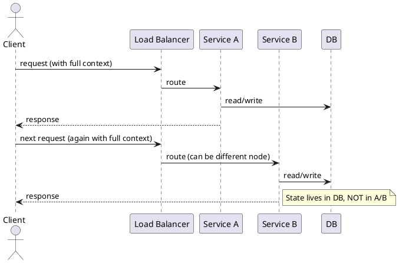
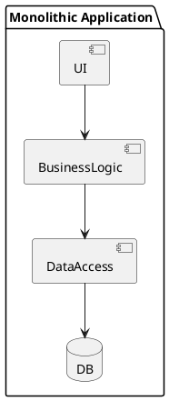
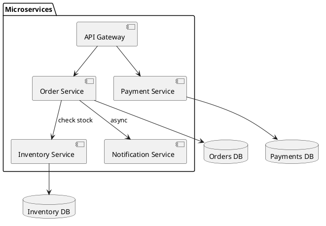
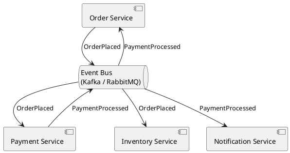
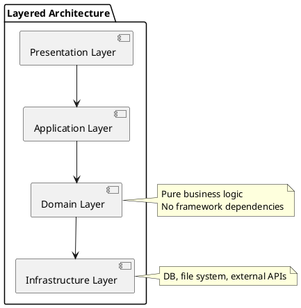
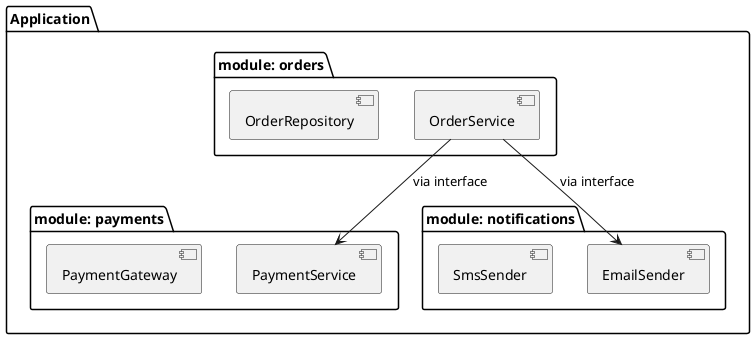

# Chapter 2: Architectural Styles

**Book Pages**: 31–51 | *Software Architecture with C++* by Ostrowski & Gaczkowski

---

## Why This Chapter Matters

Choosing an architectural style is one of the most consequential decisions in a project. It
determines how the system scales, how teams are organized, how failures propagate, and how much
operational complexity you accept. Chapter 2 surveys the major styles with their trade-offs.

---

## 2.1 Stateful vs Stateless

### Stateless Services

A stateless service holds **no client-specific session state between requests**. Every request
carries all necessary context.



**Benefits**: horizontal scaling, no sticky sessions, any replica can handle any request.

**Cost**: state must be externalised (DB, Redis, cookie) — latency for state retrieval.

### Stateful Services

A stateful service maintains client session state in memory between requests.

**Benefits**: low-latency access to session state, no round-trip to DB for every access.

**Cost**: sticky sessions required, harder to scale horizontally, state lost on crash.

---

## 2.2 Monolithic Architecture

A **monolith** packages the entire application into a single deployable unit.



### When Monoliths Are Appropriate

- Early-stage projects where requirements are unclear
- Small teams where the coordination overhead of microservices exceeds the benefit
- Performance-critical systems where inter-process communication is too expensive
- Systems that genuinely have no need for independent scaling

### When Monoliths Fail

- Team size grows beyond 8-10 people working on the same codebase
- Different modules need different scaling characteristics
- Deployment of one module requires deploying everything
- A bug in one module can crash the entire system

---

## 2.3 Service-Oriented and Microservice Architecture



### Benefits of Microservices

| Benefit | Description |
|---------|-------------|
| Independent deployment | Deploy Order service without touching Payment service |
| Independent scaling | Scale Inventory service 10x without scaling Orders |
| Technology diversity | Each service can use the best language/DB for its problem |
| Fault isolation | A crash in Notification service doesn't take down Orders |
| Team autonomy | Teams own and operate their service end-to-end |

### Disadvantages of Microservices

| Cost | Description |
|------|-------------|
| Distributed system complexity | Network failures, latency, partial failures |
| Operational overhead | Dozens of services each need CI/CD, monitoring, logging |
| Data consistency | No transactions across services — requires eventual consistency |
| Testing complexity | Integration testing across service boundaries is hard |
| Service discovery | Services must find each other dynamically |

### Microservice Characteristics (per Martin Fowler)

1. **Organized around business capabilities** — not technical layers
2. **Products not projects** — team owns service in production
3. **Decentralized data management** — each service owns its data store
4. **Infrastructure automation** — CI/CD per service
5. **Design for failure** — expect any dependency to fail at any time
6. **Evolutionary design** — services can be replaced as needs change

---

## 2.4 Event-Based Architecture

Instead of direct service calls, services communicate by publishing and consuming events.



### Event-Based Topologies

| Topology | Description |
|----------|-------------|
| **Mediator** | Central coordinator (orchestrator) routes events to handlers |
| **Broker** | Producers send events; consumers subscribe directly — no central coordinator |
| **Event sourcing** | Events are the system of record; current state is derived by replaying events |

### Event Sourcing

```
┌─────────────────────────────────────────────────────────────────────────┐
│  Event Store (append-only)                                              │
│  [OrderCreated] [ItemAdded] [ItemAdded] [OrderConfirmed] [OrderShipped] │
└───────────────────────────────────────┬─────────────────────────────────┘
                                        │ replay
                                        ▼
                               Current Order State
```

Benefits: full audit log, temporal queries, replay to any past state.
Costs: eventual consistency, complex queries (use CQRS read projections), storage grows forever.

---

## 2.5 Layered Architecture



**The Dependency Rule (Clean Architecture)**: inner layers must NOT depend on outer layers.
The domain layer must not import infrastructure types.

---

## 2.6 Module-Based Architecture

Modules (C++20 modules or logical partitions) group related components with explicit,
controlled interfaces. Think of it as a monolith with firm internal API boundaries.



---

## Common Mistakes / Anti-Patterns

| Anti-Pattern | Description | Fix |
|---|---|---|
| **Distributed monolith** | Microservices that share a DB or deploy together | Enforce data isolation; decouple deployment |
| **Chatty microservices** | Services make 20 synchronous calls per request | Consolidate or use async messaging |
| **Premature decomposition** | Splitting into microservices before domain is understood | Start with modular monolith; extract later |
| **Shared database** | Multiple services write to the same table | Each service owns its schema |
| **Ignoring fallacies** | Treating network as reliable and instantaneous | Design for partial failure from day one |
| **Event soup** | Every action is an event with no clear causality | Use commands for intent, events for facts |

---

## Trade-offs and Decision Guidelines

```
                     MONOLITH ←──────────────────────→ MICROSERVICES
Team size:           small                              large, many teams
Deployment speed:    single deploy                      per-service deploy
Operational maturity: low                              high (K8s, observability)
Domain clarity:      unclear                            well-understood
Performance:         low latency (in-process)           higher latency (network)
Scaling needs:       uniform                            heterogeneous
```

**Rule of thumb**: Start with a well-structured monolith. Extract services when a specific
module has divergent scaling, deployment, or team ownership requirements.

---

## Key Takeaways

1. **No architectural style is universally best** — every choice is a trade-off
2. **Microservices introduce distributed system complexity** — only adopt when the benefits
   outweigh the operational cost
3. **Event-driven architecture decouples producers and consumers** — but makes tracing harder
4. **Layered architecture is the foundation** — even microservices have internal layers
5. **Start simple and evolve** — a modular monolith is a legitimate and often superior choice
   to premature microservices decomposition
