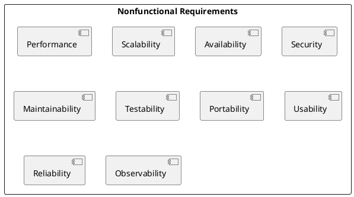
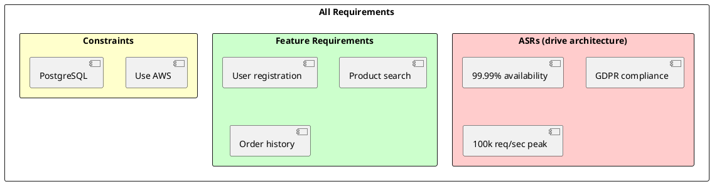
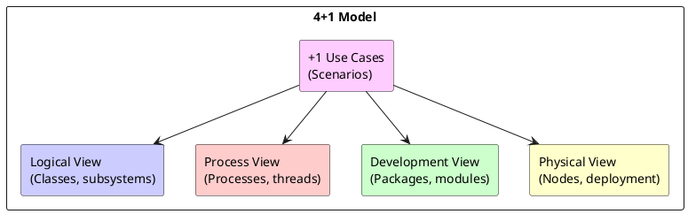
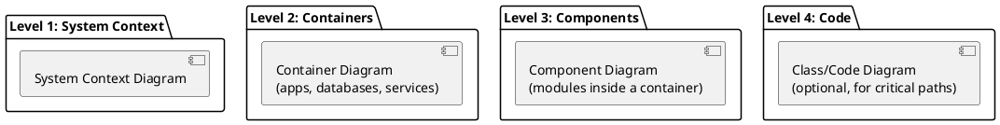

# Chapter 3: Functional and Nonfunctional Requirements

**Book Pages**: 52–90 | *Software Architecture with C++* by Ostrowski & Gaczkowski

---

## Why This Chapter Matters

Architecture decisions are only as good as the requirements they are based on. This chapter
teaches how to elicit, classify, prioritise, and document requirements in a way that drives
architecture decisions rather than just collecting feature lists.

> *"The most common cause of architectural failure is not picking the wrong pattern — it is solving
> the wrong problem."* — paraphrased

---

## 3.1 Types of Requirements

### Functional Requirements

Functional requirements define **what the system must do**:
- "The system shall allow users to place orders"
- "The system shall send a confirmation email within 30 seconds of order placement"
- "The API shall support pagination with page sizes from 1 to 100"

Functional requirements describe capabilities, behaviours, and business logic.

### Nonfunctional Requirements (Quality Attributes)

Nonfunctional requirements define **how well the system must do it**:



| Quality Attribute | Example Requirement |
|------------------|---------------------|
| **Performance** | 95th percentile API response time < 200ms under 1000 concurrent users |
| **Availability** | 99.95% uptime (< 4.4 hours downtime/year) |
| **Scalability** | Must handle 10x traffic spike without configuration change |
| **Security** | All PII data encrypted at rest and in transit (AES-256) |
| **Maintainability** | New developer productive within 1 week; change to one module affects ≤ 2 others |
| **Testability** | 80%+ unit test coverage; all services testable in isolation without external deps |
| **Observability** | All errors logged with trace ID; latency dashboards per endpoint |

### Constraints

Constraints are requirements that are non-negotiable:
- "Must use PostgreSQL" (existing infrastructure)
- "Must be deployable to AWS GovCloud" (compliance)
- "Must integrate with SAP" (existing system)
- "Must use C++17 or earlier" (compiler limitation)

Constraints differ from quality attributes: they cannot be traded off.

---

## 3.2 Architecturally Significant Requirements (ASRs)

Not all requirements affect architecture equally. **ASRs** are requirements whose satisfaction
requires fundamental architectural decisions.

### Indicators of Architectural Significance

A requirement is architecturally significant if satisfying it:
- Forces a particular distribution or partitioning of the system
- Requires a specific technology or protocol
- Creates a major risk if not addressed early
- Affects many other requirements (cross-cutting concern)
- Has stringent performance/security/availability targets



### Common Hindrances in Recognising ASRs

1. **Stakeholders don't know what is architecturally difficult** — they describe wishes, not
   constraints
2. **Implicit requirements** — "Of course it needs to be secure" — never stated explicitly
3. **Requirements change** — ASR today may be trivial tomorrow with new technology
4. **Conflicting priorities** — performance vs security vs maintainability require explicit
   trade-off decisions

---

## 3.3 Gathering Requirements

### From Stakeholders

Key stakeholder types and their typical quality priorities:

| Stakeholder | Primary Concern |
|------------|-----------------|
| End users | Usability, performance, availability |
| Business owners | Time-to-market, cost, compliance |
| Operations | Deployability, observability, reliability |
| Security team | Security, auditability |
| Developers | Maintainability, testability, build speed |

### Techniques

- **Interviews**: Open-ended questions with key stakeholders
- **Workshops**: Cross-functional groups to surface conflicts early
- **Scenarios**: "Walk me through what happens when X" — reveals hidden requirements
- **Quality Attribute Workshop (QAW)**: Structured elicitation of quality scenarios
- **Existing system analysis**: Study current pain points and failure modes

---

## 3.4 Documenting Requirements

### Context Diagram

```plantuml
@startuml
!include https://raw.githubusercontent.com/plantuml-stdlib/C4-PlantUML/master/C4_Context.puml
Person(customer, "Customer", "Places orders")
Person(admin, "Admin", "Manages products")
System(ecommerce, "E-Commerce Platform", "Handles ordering, payments, fulfilment")
System_Ext(payment_gw, "Payment Gateway", "Stripe / PayPal")
System_Ext(email, "Email Service", "SendGrid")
System_Ext(erp, "ERP System", "SAP", "Legacy")
Rel(customer, ecommerce, "Places orders, tracks shipments")
Rel(admin, ecommerce, "Manages catalogue")
Rel(ecommerce, payment_gw, "Processes payments")
Rel(ecommerce, email, "Sends notifications")
Rel(ecommerce, erp, "Syncs inventory")
@enduml
```

---

## 3.5 Architecture Documentation Models

### The 4+1 Architectural View Model



| View | Concerns | Diagram types |
|------|----------|---------------|
| **Logical** | Functionality, classes | Class diagrams, state diagrams |
| **Process** | Concurrency, synchronisation | Activity diagrams, sequence diagrams |
| **Development** | Code organization, build structure | Package/component diagrams |
| **Physical** | Deployment topology | Deployment diagrams |
| **+1 Scenarios** | Key use-cases that exercise the architecture | Use-case and sequence diagrams |

### The C4 Model

A simpler, more practical model widely used in the industry:



- **Level 1 (Context)**: What does the system do? Who uses it? What does it interact with?
- **Level 2 (Containers)**: What are the major deployable units? How do they communicate?
- **Level 3 (Components)**: What are the major modules inside each container?
- **Level 4 (Code)**: Class-level detail (only for critical/complex areas)

---

## 3.6 Documenting Architecture in Agile Projects

Agile does not mean "no documentation". It means *just enough* documentation:

- **Architecture Decision Records (ADRs)**: Lightweight records of each significant decision,
  capturing context, options considered, decision made, and consequences
- **Living documentation**: Generated from code (Doxygen, PlantUML from annotations)
- **Lightweight README**: Key decisions and constraints at a glance for new developers

### ADR Template

```markdown
# ADR-001: Use PostgreSQL for order data

## Status: Accepted

## Context
Orders require ACID transactions. Multiple services need to read order history.

## Decision
Use PostgreSQL. Each service has its own schema within the shared cluster.

## Consequences
+ Strong consistency for order state
+ Familiar tooling across teams
- Shared cluster is a coupling point — plan to shard by service later
```

---

## Common Mistakes / Anti-Patterns

| Anti-Pattern | Description | Fix |
|---|---|---|
| **Feature list masquerading as requirements** | "Add a search feature" — no quality target | Add measurable quality attributes: "Search returns results in < 500ms" |
| **Big upfront specification** | 200-page spec before any code | Prioritise ASRs first; detail emerges iteratively |
| **Missing NFRs** | Only functional requirements documented | Use a quality attribute checklist |
| **Goldplating** | Overspecifying: "five nines availability" for an internal admin tool | Right-size requirements to actual business need |
| **No stakeholder alignment** | Architecture designed without stakeholder input | Hold Architecture Decision Reviews with all stakeholders |
| **Undocumented decisions** | "We chose Kafka for messaging" — no record of why | Use ADRs for every significant decision |

---

## Key Takeaways

1. **Functional requirements say what; NFRs say how well** — both drive architecture
2. **Identify ASRs early** — they are the requirements with the highest architectural impact
3. **Quality attributes need measurable targets** — vague requirements produce vague architecture
4. **The 4+1 and C4 models** provide structured vocabulary for documenting architecture
5. **ADRs capture the reasoning**, not just the decision — future teams need to understand *why*
6. **Documentation should be just enough** — living documents, not static specs
