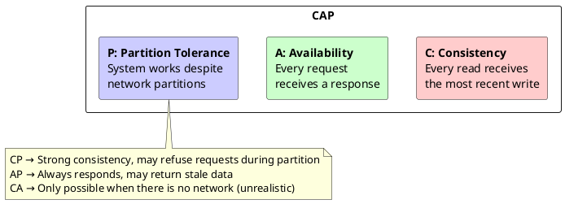
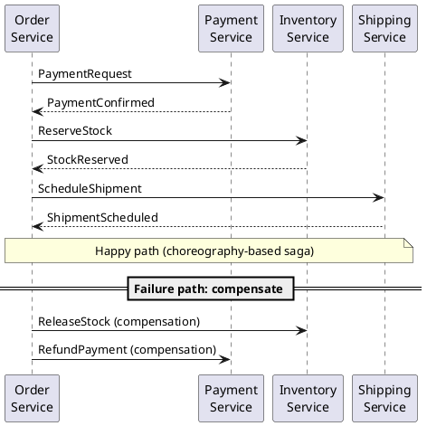
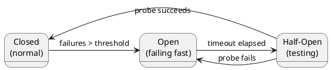
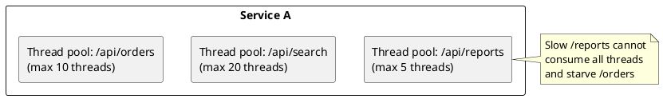
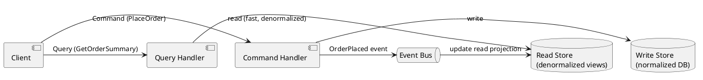
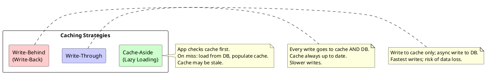

# Chapter 4: Architectural and System Design

**Book Pages**: 92–132 | *Software Architecture with C++* by Ostrowski & Gaczkowski

---

## Why This Chapter Matters

Most modern C++ systems are distributed. This chapter covers the fundamental challenges of
distributed systems — the fallacies, the CAP theorem, fault tolerance patterns — and the design
patterns (CQRS, event sourcing, caching) that address them.

---

## 4.1 The Fallacies of Distributed Computing

Peter Deutsch's eight fallacies — assumptions developers make that are **always false**:

| Fallacy | Why It Hurts |
|---------|-------------|
| The network is reliable | Networks drop packets, time out, partition |
| Latency is zero | Cross-datacenter calls: 50–200ms; cross-continent: 100–300ms |
| Bandwidth is infinite | Large payloads degrade under load |
| The network is secure | All traffic must be encrypted; zero-trust model |
| Topology doesn't change | Nodes come and go; IPs change; DNS TTLs matter |
| There is one administrator | Multiple teams, orgs, and cloud providers |
| Transport cost is zero | Serialisation, TLS handshake, and egress costs |
| The network is homogeneous | Different protocols, versions, and encodings coexist |

> **Design rule**: Design every distributed call as if the remote service is unreliable,
> slow, and will occasionally return garbage.

---

## 4.2 CAP Theorem

A distributed system can provide at most **2 of 3** guarantees:



**In practice**: network partitions happen. You must choose CP or AP.

- **CP examples**: etcd, ZooKeeper, Consul — distributed coordination, leader election
- **AP examples**: Cassandra, DynamoDB, CouchDB — high availability, eventual consistency

---

## 4.3 Sagas and Compensating Transactions

Cross-service transactions cannot use a distributed ACID transaction (too slow, too fragile).
Instead, use **sagas**: a sequence of local transactions linked by events.



### Choreography vs Orchestration

| Style | Description | Trade-off |
|-------|-------------|-----------|
| **Choreography** | Each service reacts to events and publishes its own | Decoupled, harder to trace |
| **Orchestration** | Central saga coordinator drives the process | Clear flow, central coupling point |

---

## 4.4 Fault Tolerance Patterns

### Circuit Breaker



- **Closed**: requests pass through; failures counted
- **Open**: requests immediately fail (no waiting for timeout) — protects downstream
- **Half-Open**: occasional probe sent; if it succeeds, return to Closed

### Bulkhead

Isolate resource pools so failure in one area doesn't starve others:



### Retry with Exponential Backoff

```
Attempt 1: immediately
Attempt 2: wait 100ms
Attempt 3: wait 200ms
Attempt 4: wait 400ms + jitter
... up to max retries
```

**Always add jitter** to prevent thundering herd when a service recovers.

---

## 4.5 CQRS and Event Sourcing

### Command-Query Responsibility Segregation (CQRS)

Separate the read (query) and write (command) models:



**Benefits**:
- Read and write models can be scaled independently
- Read models can be optimised for specific query patterns (denormalized, cached)
- Write model focuses on business rule enforcement

**Costs**:
- Eventual consistency between write and read models
- More moving parts; more code to maintain

### Command-Query Separation (CQS) — simpler variant

At the method level: a method either **changes state** (command) or **returns data** (query),
never both. This makes reasoning about code far easier.

---

## 4.6 Caching



| Strategy | Read latency | Write latency | Consistency | Risk |
|----------|-------------|---------------|-------------|------|
| Cache-aside | Low (on hit) | DB speed | Eventual | Stale data |
| Write-through | Low | Higher | Strong | Extra writes |
| Write-behind | Low | Very low | Eventual | Data loss on crash |

---

## 4.7 Deployment Patterns

### Blue-Green Deployment

```
Blue (current live):  v1.0 ─────────────────────────────→ (deprecated after switch)
                                         ↑ traffic switch
Green (new version):  v2.0 ─────────────┘
```

Zero-downtime: run both versions; switch load balancer; roll back instantly by switching back.

### Canary Release

Gradually shift traffic to the new version:
```
100% → v1.0
 90% → v1.0 | 10% → v2.0   (canary)
 50% → v1.0 | 50% → v2.0   (ramp up)
  0% → v1.0 |100% → v2.0   (complete)
```

---

## Common Mistakes / Anti-Patterns

| Anti-Pattern | Description | Fix |
|---|---|---|
| **Ignoring fallacies** | Writing synchronous code that assumes network calls succeed | Add timeouts, retries, circuit breakers |
| **Two-phase commit** | Distributed ACID across services | Use sagas with compensating transactions |
| **Cache everything** | Adding cache before measuring where bottleneck is | Profile first; cache only proven hot paths |
| **No cache invalidation strategy** | Cache grows stale; users see wrong data | Define TTL and event-driven invalidation upfront |
| **CQRS everywhere** | Adding read/write split to simple CRUD services | Only use CQRS where read/write workloads genuinely differ |
| **Retry storms** | All clients retry simultaneously when service recovers | Add jitter to backoff |

---

## Key Takeaways

1. **Design for failure** — every distributed call can fail; assume it will
2. **CAP forces a choice** — know whether your system prioritises consistency or availability
3. **Sagas, not distributed transactions** — compensate at the business level
4. **Circuit breakers protect the system** — fail fast rather than waiting for timeout chains
5. **CQRS is powerful but not free** — only adopt it when read and write concerns genuinely diverge
6. **Cache invalidation is the hardest part** — define the strategy before building the cache
