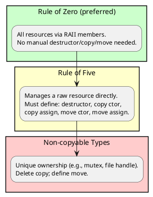
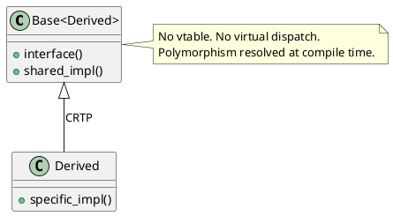
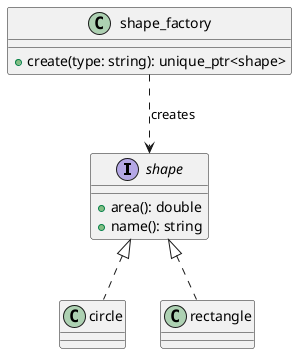
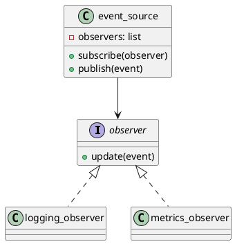

# Chapter 6: Design Patterns and C++

**Book Pages**: 165–203 | *Software Architecture with C++* by Ostrowski & Gaczkowski

---

## Why This Chapter Matters

Design patterns encode proven solutions to recurring design problems. In C++, many classic
patterns have more efficient, idiomatic implementations using templates, RAII, and modern
language features. This chapter shows how to implement patterns in a way that is both
architecturally sound and leverages C++'s unique capabilities.

---

## 6.1 RAII Guards — Automating Scope Exit

The RAII guard (scope-exit) is C++'s answer to `finally` blocks:

```cpp
template<typename Fn>
class scope_guard {
    Fn fn_;
    bool active_ = true;
public:
    explicit scope_guard(Fn fn) : fn_(std::move(fn)) {}
    ~scope_guard() { if (active_) fn_(); }
    void dismiss() { active_ = false; }
};
```

Usage: database transactions, lock release, temporary state restoration.

---

## 6.2 Copyability and Movability Rules

### Rule of Three / Five / Zero



```cpp
// Rule of zero: resource managed by unique_ptr
class widget {
    std::unique_ptr<impl> impl_;
public:
    widget();
    ~widget();         // declared in .cpp where impl is complete
    widget(widget&&) = default;
    widget& operator=(widget&&) = default;
    // No copy — unique ownership
    widget(const widget&) = delete;
    widget& operator=(const widget&) = delete;
};
```

---

## 6.3 Policy-Based Design

Instead of runtime polymorphism, use compile-time policies via templates:

```cpp
template<typename SortPolicy, typename AllocPolicy>
class container {
    SortPolicy  sorter_;
    AllocPolicy allocator_;
public:
    void add(int value) { allocator_.allocate(); sorter_.insert(value); }
};

// Compose at instantiation — zero runtime cost
using fast_container = container<QuickSortPolicy, PoolAllocPolicy>;
using safe_container = container<StableSortPolicy, TrackingAllocPolicy>;
```

**Trade-off**: compile-time flexibility vs binary size (each instantiation generates code).

---

## 6.4 Curiously Recurring Template Pattern (CRTP)

CRTP provides static polymorphism — virtual dispatch overhead eliminated:



```cpp
template<typename Derived>
class serializable {
public:
    std::string serialise() const {
        return static_cast<const Derived*>(this)->to_json();
    }
};

class user : public serializable<user> {
public:
    std::string to_json() const { return "{\"name\":\"Alice\"}"; }
};
```

Use when: the type set is closed at compile time and performance is critical.

---

## 6.5 Type Erasure

Type erasure lets you store different types with the same interface in a single container
without virtual inheritance:

```cpp
// std::function is the canonical type-erased callable
std::function<void(int)> handler;
handler = [](int x) { std::cout << x; };  // lambda
handler = &free_function;                   // function pointer
handler = functor_object;                   // functor

// std::any: type-erased container for any value
std::any value = 42;
value = std::string("hello");
// Cast back to original type
auto s = std::any_cast<std::string>(value);
```

---

## 6.6 Creational Patterns

### Factory Method



```cpp
std::unique_ptr<shape> shape_factory::create(const std::string& type) {
    if (type == "circle")    return std::make_unique<circle>(5.0);
    if (type == "rectangle") return std::make_unique<rectangle>(3.0, 4.0);
    throw std::invalid_argument("unknown shape: " + type);
}
```

### Builder Pattern

Use when object construction has many optional parameters:

```cpp
class server_config {
    int port_ = 8080;
    std::string host_ = "0.0.0.0";
    int timeout_ms_ = 5000;
public:
    server_config& port(int p)     { port_ = p; return *this; }
    server_config& host(const std::string& h) { host_ = h; return *this; }
    server_config& timeout(int ms) { timeout_ms_ = ms; return *this; }
};

// Fluent API
auto config = server_config{}
    .port(9090)
    .host("localhost")
    .timeout(10000);
```

---

## 6.7 Observer Pattern



The C++ idiomatic version uses `std::function` callbacks (no inheritance required):

```cpp
class event_source {
    std::vector<std::function<void(const std::string&)>> handlers_;
public:
    void subscribe(std::function<void(const std::string&)> handler) {
        handlers_.push_back(std::move(handler));
    }
    void emit(const std::string& event) {
        for (auto& h : handlers_) h(event);
    }
};
```

---

## 6.8 Memory Efficiency Patterns

### Small String Optimisation (SSO) / Small Object Optimisation (SOO)

Store small objects inline to avoid heap allocation:

```cpp
// std::string uses SSO internally — strings < ~15 chars stored inline
std::string short_str = "hello";    // no heap allocation
std::string long_str(100, 'x');     // heap allocated

// std::variant: type-safe union — no heap allocation
std::variant<int, double, std::string> v = 42;
v = 3.14;
v = std::string("hello");
std::cout << std::get<std::string>(v); // "hello"
```

### Polymorphic Allocators (C++17)

```cpp
#include <memory_resource>
// Stack buffer — zero heap allocation
alignas(std::max_align_t) char buffer[1024];
std::pmr::monotonic_buffer_resource resource(buffer, sizeof(buffer));
std::pmr::vector<int> data(&resource);
data.push_back(1);
data.push_back(2);
// All allocations come from stack buffer
```

---

## Common Mistakes / Anti-Patterns

| Anti-Pattern | Description | Fix |
|---|---|---|
| **Factory that returns raw pointers** | `shape* create(...)` — caller must delete | Return `std::unique_ptr<shape>` |
| **Virtual functions in CRTP** | Mixing static and dynamic polymorphism | Choose one; they don't combine well |
| **Observer not unregistered** | Callbacks hold dangling references | Use `std::weak_ptr` or explicit unsubscribe |
| **Forgotten Rule of Five** | Managing raw resource but missing copy/move | Apply rule of five or refactor to use RAII members |
| **Premature type erasure** | Adding `std::any` before the interface is stable | Use concrete types until the abstraction is proven necessary |

---

## Key Takeaways

1. **RAII replaces `finally`** — scope guards automate any cleanup, not just memory
2. **Rule of zero first** — only write special member functions when managing a raw resource
3. **CRTP for compile-time polymorphism** — when the type set is fixed and performance matters
4. **Factories return unique_ptr** — ownership is explicit from the creation point
5. **Polymorphic allocators** — for performance-critical code, control allocation strategy without
   changing container types
6. **Type erasure** — `std::function`, `std::any`, `std::variant` are the standard tools
