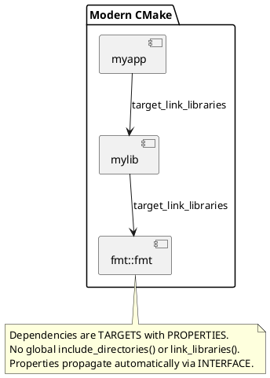

# Chapter 7: Building and Packaging

**Book Pages**: 205–243 | *Software Architecture with C++* by Ostrowski & Gaczkowski

---

## Why This Chapter Matters

A sophisticated build and packaging system is what separates a prototype from a production
library. This chapter covers modern CMake, dependency management with Conan, compiler-based
tooling, and static analysis — all essential for shipping reliable C++ software.

---

## 7.1 Getting the Most Out of Compilers

### Using Multiple Compilers

Compile with GCC, Clang, and MSVC. Each finds different issues:
- **GCC**: strongest template error messages with recent `-fconcepts`
- **Clang**: best static analyser integration, `clang-tidy`, Address Sanitizer
- **MSVC**: Windows-specific issues, `/analyze` static analysis

```bash
# CI matrix: build with all compilers
cmake -DCMAKE_CXX_COMPILER=g++ ..
cmake -DCMAKE_CXX_COMPILER=clang++ ..
```

### Reducing Build Times

| Technique | Effect |
|-----------|--------|
| Precompiled headers (`target_precompile_headers`) | 2–5× speedup for heavy headers |
| Unity builds (`CMAKE_UNITY_BUILD`) | Merge TUs; fewer compilations |
| Incremental builds (Ninja generator) | Only recompile what changed |
| `ccache` | Cache compilation results |
| Forward declarations instead of includes | Smaller translation units |

---

## 7.2 Finding Potential Code Issues

### Compiler Warnings as Errors

```cmake
target_compile_options(my_target PRIVATE
    $<$<CXX_COMPILER_ID:GNU,Clang>:
        -Wall -Wextra -Wpedantic -Wshadow -Wnon-virtual-dtor
        -Wold-style-cast -Woverloaded-virtual -Wconversion
    >
    $<$<CXX_COMPILER_ID:MSVC>:/W4 /WX>
)
```

### Static Analysis Tools

| Tool | What It Catches |
|------|----------------|
| `clang-tidy` | Style issues, modernisation suggestions, bug patterns |
| `cppcheck` | Undefined behaviour, memory issues, style |
| `include-what-you-use` | Missing/unnecessary `#include` |
| `PVS-Studio` | Broad bug class detection (commercial) |
| SonarQube | Continuous quality gates in CI |

```cmake
# Enable clang-tidy in CMake
set(CMAKE_CXX_CLANG_TIDY
    clang-tidy;
    -checks=modernize-*,readability-*,performance-*,bugprone-*;
    -warnings-as-errors=*)
```

---

## 7.3 Modern CMake

### Project Structure

```cmake
cmake_minimum_required(VERSION 3.20)
project(MyLib VERSION 1.2.3 LANGUAGES CXX)

# Target-based CMake — NO global variables
add_library(mylib STATIC
    src/mylib.cpp
)
target_include_directories(mylib
    PUBLIC  $<BUILD_INTERFACE:${CMAKE_CURRENT_SOURCE_DIR}/include>
            $<INSTALL_INTERFACE:include>
    PRIVATE src/
)
target_compile_features(mylib PUBLIC cxx_std_20)
target_compile_options(mylib PRIVATE -Wall -Wextra)
```

### Key Principle: Target-Based CMake



### Generator Expressions

```cmake
target_compile_options(mylib PRIVATE
    # Only for Debug builds
    $<$<CONFIG:Debug>:-g3 -O0 -fsanitize=address>
    # Only for Release builds
    $<$<CONFIG:Release>:-O3 -DNDEBUG>
    # Only for GCC/Clang
    $<$<CXX_COMPILER_ID:GNU,Clang>:-Wall -Wextra>
)
```

---

## 7.4 Using External Modules

### FetchContent (built-in CMake)

```cmake
include(FetchContent)
FetchContent_Declare(
    googletest
    GIT_REPOSITORY https://github.com/google/googletest.git
    GIT_TAG        v1.14.0
)
FetchContent_MakeAvailable(googletest)
target_link_libraries(my_tests PRIVATE GTest::gtest_main)
```

### Conan Package Manager

```ini
# conanfile.txt
[requires]
boost/1.82.0
fmt/10.1.1
spdlog/1.12.0

[generators]
CMakeDeps
CMakeToolchain
```

```bash
# Install deps
conan install . --output-folder=build --build=missing
# Build
cmake -S . -B build -DCMAKE_TOOLCHAIN_FILE=build/conan_toolchain.cmake
cmake --build build
```

---

## 7.5 Adding Tests

```cmake
enable_testing()
include(GoogleTest)

add_executable(mylib_tests
    tests/test_mylib.cpp
)
target_link_libraries(mylib_tests
    PRIVATE mylib GTest::gtest_main
)
gtest_discover_tests(mylib_tests)
```

Run: `ctest --test-dir build --output-on-failure`

---

## 7.6 Installing and Exporting

```cmake
# Install targets
install(TARGETS mylib
    EXPORT  mylibTargets
    ARCHIVE DESTINATION lib
    LIBRARY DESTINATION lib
    RUNTIME DESTINATION bin
)
install(DIRECTORY include/ DESTINATION include)

# Install CMake package config
install(EXPORT mylibTargets
    FILE     mylibTargets.cmake
    NAMESPACE mylib::
    DESTINATION lib/cmake/mylib
)
```

Now consumers can use `find_package(mylib)` and `target_link_libraries(app mylib::mylib)`.

---

## Common Mistakes / Anti-Patterns

| Anti-Pattern | Description | Fix |
|---|---|---|
| **Global CMake variables** | `include_directories(...)` globally | Use `target_include_directories` |
| **Hardcoded paths** | `/usr/local/include/boost` in CMake | Use `find_package` or Conan |
| **No install target** | Library has no `install()` — consumers must use source | Add proper install rules |
| **Missing compile features** | Using C++20 without `target_compile_features` | Always specify the standard |
| **Tests not run in CI** | Tests exist but CI doesn't run them | Add `ctest` step to pipeline |
| **Warnings not treated as errors** | Warnings accumulate silently | `-Wall -Werror` or `/WX` in CI |

---

## Key Takeaways

1. **Target-based CMake** — all properties attached to targets, never global
2. **Generator expressions** — conditions on build type, platform, and compiler
3. **Conan or vcpkg** — use a package manager; never copy-paste third-party source
4. **clang-tidy + cppcheck in CI** — catch issues before code review
5. **Sanitizers in Debug builds** — Address, Thread, and UB sanitizers catch hard-to-reproduce bugs
6. **Install rules from day one** — a library without install rules can't be consumed
