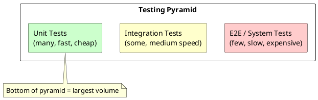
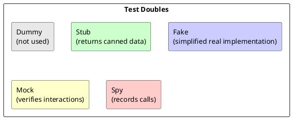
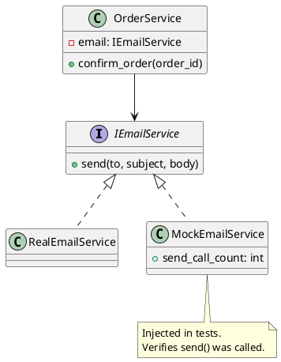
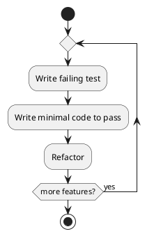

# Chapter 8: Writing Testable Code

**Book Pages**: 245–269 | *Software Architecture with C++* by Ostrowski & Gaczkowski

---

## Why This Chapter Matters

Testable code is not a side effect of good architecture — it is one of its primary outputs.
Code that is hard to test is code that is poorly designed. This chapter shows how architectural
decisions directly enable or prevent fine-grained unit testing.

---

## 8.1 Why Test Code?

### The Testing Pyramid



| Level | Scope | Speed | Cost | Volume |
|-------|-------|-------|------|--------|
| Unit | Single class/function | Milliseconds | Very low | Hundreds to thousands |
| Integration | Multiple components + real deps | Seconds | Medium | Tens to hundreds |
| E2E / System | Full system via UI/API | Minutes | High | Tens |

> **Rule**: The testing pyramid is a guideline, not a law. But deviating from it should
> be a deliberate trade-off, not an accident.

### Benefits Beyond Bug Detection

- **Regression protection**: changes that break existing behaviour are caught immediately
- **Documentation**: tests show how code should be used
- **Design feedback**: if a test is hard to write, the design has a flaw
- **Refactoring safety net**: confidence to improve without fear of breaking things

---

## 8.2 Testing Frameworks

### GTest (Google Test)

```cpp
#include <gtest/gtest.h>

TEST(PricingServiceTest, ApplyTaxReturnsCorrectTotal) {
    pricing_service ps(0.2);
    EXPECT_DOUBLE_EQ(ps.apply_tax(100.0), 120.0);
}

TEST(PricingServiceTest, ZeroAmountRemainsZero) {
    pricing_service ps(0.2);
    EXPECT_DOUBLE_EQ(ps.apply_tax(0.0), 0.0);
}
```

### Catch2

```cpp
#include <catch2/catch_test_macros.hpp>

TEST_CASE("pricing_service applies correct tax", "[pricing]") {
    pricing_service ps{0.2};
    SECTION("standard amount") {
        REQUIRE(ps.apply_tax(100.0) == Approx(120.0));
    }
    SECTION("zero amount") {
        REQUIRE(ps.apply_tax(0.0) == Approx(0.0));
    }
}
```

---

## 8.3 Mocks and Fakes

### Test Double Taxonomy



| Double | When to Use | Example |
|--------|-------------|---------|
| **Dummy** | Fill parameter slot, not called | `nullptr` for unused logger |
| **Stub** | Control inputs to the system under test | Return fixed data from a repo |
| **Fake** | Faster/simpler alternative to real dep | In-memory DB instead of PostgreSQL |
| **Mock** | Verify interactions (was `send()` called?) | Assert email was sent once |
| **Spy** | Record calls for later assertion | Count how many times method called |

### Dependency Injection Enables Testing



```cpp
// Production code — depends on interface
class order_service {
    i_email_service& email_;
public:
    explicit order_service(i_email_service& email) : email_(email) {}
    void confirm_order(int id) {
        email_.send("customer@x.com", "Order Confirmed", "...");
    }
};

// Test double — in-memory fake
class fake_email_service : public i_email_service {
public:
    int send_count = 0;
    std::string last_subject;
    void send(const std::string& to, const std::string& subject,
              const std::string& body) override {
        ++send_count;
        last_subject = subject;
    }
};

// Test — no real email sent
TEST(OrderServiceTest, ConfirmOrderSendsEmail) {
    fake_email_service fake;
    order_service svc(fake);
    svc.confirm_order(42);
    EXPECT_EQ(fake.send_count, 1);
    EXPECT_EQ(fake.last_subject, "Order Confirmed");
}
```

---

## 8.4 Test-Driven Class Design

### TDD Workflow



1. **Red**: Write a test that fails (because the feature doesn't exist yet)
2. **Green**: Write the minimal code to make the test pass
3. **Refactor**: Clean up without breaking tests

### Design Benefits of TDD

- Forces interface design before implementation
- Each class naturally becomes testable in isolation
- Prevents overengineering (you only write code that passes a test)
- Documents intended behaviour

---

## 8.5 Testing Infrastructure Code

### Testing with Serverspec-style patterns

Infrastructure tests verify that the deployed system is configured correctly:

```ruby
# Serverspec example (Ruby DSL)
describe package('nginx') do
  it { should be_installed }
end
describe service('nginx') do
  it { should be_running }
  it { should be_enabled }
end
describe port(80) do
  it { should be_listening }
end
```

For C++ developers: use contract tests to verify that concrete infrastructure implementations
satisfy the interface contract.

---

## Common Mistakes / Anti-Patterns

| Anti-Pattern | Description | Fix |
|---|---|---|
| **Testing implementation details** | Test private methods directly | Test public interface only; refactor if needed |
| **Tight coupling in tests** | Test creates real DB, network sockets | Use dependency injection + test doubles |
| **Assertion-free tests** | Test runs but makes no assertions | Every test must assert something |
| **Testing the mock** | Extensive setup for mock that doesn't reflect real behaviour | Use fake/stub instead of mock |
| **Non-deterministic tests** | Tests pass sometimes, fail sometimes | Isolate time, randomness, and external state |
| **Long tests** | 500-line test method | One assertion per test concept; split large tests |
| **No test for edge cases** | Only tests happy path | Test: null, empty, boundary values, error paths |

---

## Key Takeaways

1. **Testability is a first-class quality attribute** — design for it from day one
2. **If code is hard to test, the design is wrong** — use the difficulty as feedback
3. **Dependency injection is the enabler** — inject interfaces, not concrete dependencies
4. **Use the right test double** — stubs for inputs, mocks for interaction verification, fakes for
   complex dependencies
5. **TDD is a design technique**, not just a testing technique
6. **The testing pyramid guides investment** — most value from fast, focused unit tests
