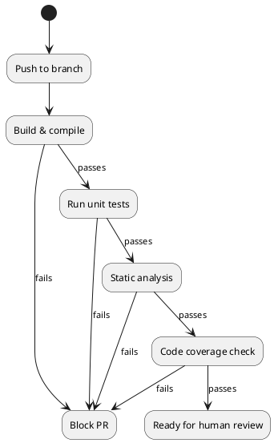
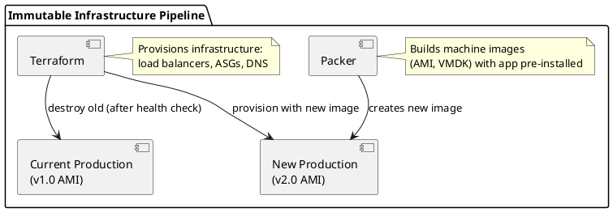
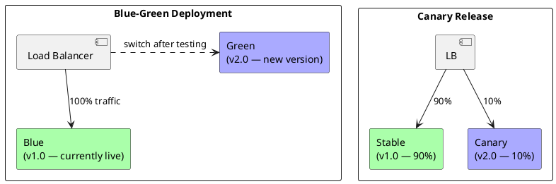

# Chapter 9: Continuous Integration and Continuous Deployment

**Book Pages**: 257–294 | *Software Architecture with C++* by Ostrowski & Gaczkowski

---

## Why This Chapter Matters

Modern software delivery requires automation at every step. This chapter covers the CI/CD
pipeline: from code commit to production deployment, including automated testing, code review,
infrastructure automation, and immutable deployments.

---

## 9.1 Continuous Integration

CI is the practice of merging developer changes to a shared mainline frequently — multiple
times per day — with automated verification at every merge.

### CI Principles

> *"Release early, release often"* — the longer code sits in a branch, the harder the merge.

| Principle | Practice |
|-----------|----------|
| Merge frequently | Feature branches live < 1-2 days |
| Automated build | Every push triggers a build |
| Automated tests | All unit + integration tests run on every push |
| Fast feedback | Build + test pipeline < 10 minutes |
| Fix broken builds immediately | Broken main blocks all other developers |

### Implementing CI with GitLab CI

```yaml
# .gitlab-ci.yml
stages:
  - build
  - test
  - analyze
  - package

variables:
  BUILD_DIR: build

build:
  stage: build
  image: gcc:13
  script:
    - cmake -B $BUILD_DIR -DCMAKE_BUILD_TYPE=Debug
    - cmake --build $BUILD_DIR -j$(nproc)
  artifacts:
    paths:
      - $BUILD_DIR/

unit_tests:
  stage: test
  script:
    - ctest --test-dir $BUILD_DIR --output-on-failure
  dependencies:
    - build

static_analysis:
  stage: analyze
  image: silkeh/clang:16
  script:
    - cmake -B $BUILD_DIR -DCMAKE_CXX_CLANG_TIDY=clang-tidy
    - cmake --build $BUILD_DIR
  allow_failure: false
```

---

## 9.2 Code Review

### Automated Gating Mechanisms

Before human review, automated checks must pass:



### Code Review Best Practices

- **Review the design, not the formatting** — let `clang-format` handle formatting
- **Small PRs** — < 400 lines changed; easier to review thoroughly
- **Context in PR description** — why, not just what
- **Author addresses comments, not dismisses** — discussion is valuable

---

## 9.3 Test-Driven Automation

### Behaviour-Driven Development (BDD)

BDD uses plain-language scenarios to bridge stakeholders and developers:

```gherkin
# order.feature
Feature: Order placement
  Scenario: Customer places a valid order
    Given the customer "Alice" has 100.00 credits
    When she places an order for "Widget Pro" at 29.99
    Then the order is confirmed
    And her credit balance is 70.01
    And she receives a confirmation email
```

BDD scenarios become automated tests. Gherkin scenarios serve as living documentation.

---

## 9.4 Managing Deployment as Code

### Ansible Playbook (Infrastructure as Code)

```yaml
# deploy_app.yml
- hosts: app_servers
  tasks:
    - name: Pull latest Docker image
      docker_image:
        name: myapp
        tag: "{{ version }}"
        source: pull

    - name: Stop current container
      docker_container:
        name: myapp
        state: stopped

    - name: Start new container
      docker_container:
        name: myapp
        image: "myapp:{{ version }}"
        state: started
        ports:
          - "8080:8080"
        env:
          DATABASE_URL: "{{ db_url }}"
```

### Building Immutable Infrastructure with Packer + Terraform



**Immutable infrastructure benefits**:
- No configuration drift — every server built from the same image
- Rollback = deploy previous image version
- Every deployment is a full replace, never a patch

---

## 9.5 Blue-Green and Canary Deployments



---

## Common Mistakes / Anti-Patterns

| Anti-Pattern | Description | Fix |
|---|---|---|
| **Long-lived branches** | Feature branches live for weeks | Merge to main at least daily |
| **No gating** | Broken code reaches main | All CI checks required before merge |
| **Manual deployment** | Someone SSHs to run commands | All deployments automated and repeatable |
| **No rollback plan** | Deploy fails, unclear how to recover | Blue-green or feature flags enable instant rollback |
| **Monolithic pipeline** | 40-minute CI run | Parallelise; fast tests first; expensive tests nightly |
| **Configuration in code** | DB passwords, hostnames hardcoded | External configuration store; environment variables |

---

## Key Takeaways

1. **CI is a culture, not just a tool** — merge early, merge often, fix broken builds immediately
2. **Automated gates before human review** — humans review logic, not formatting or broken builds
3. **Infrastructure as code** — Ansible, Terraform, Packer make deployments reproducible
4. **Immutable infrastructure** — replace, don't patch; every server is fresh
5. **Blue-green or canary** — zero-downtime deployments with instant rollback capability
6. **BDD bridges business and development** — plain-language scenarios become executable tests
